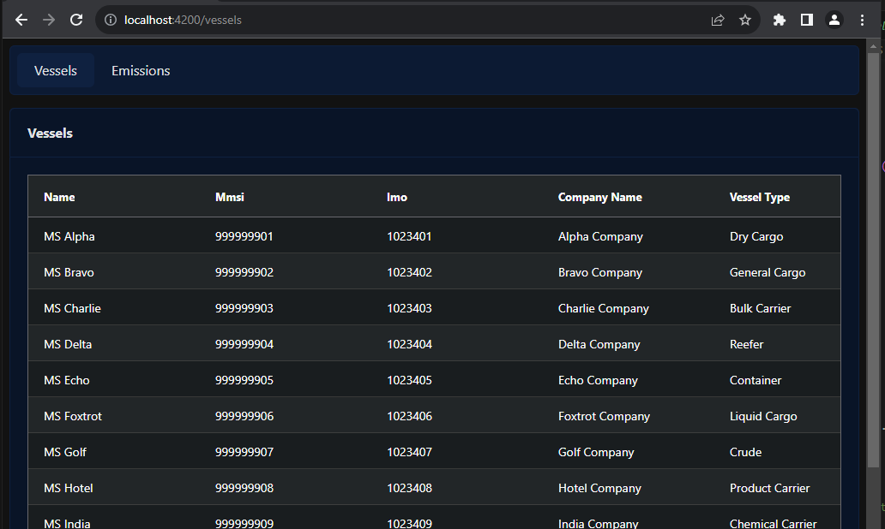
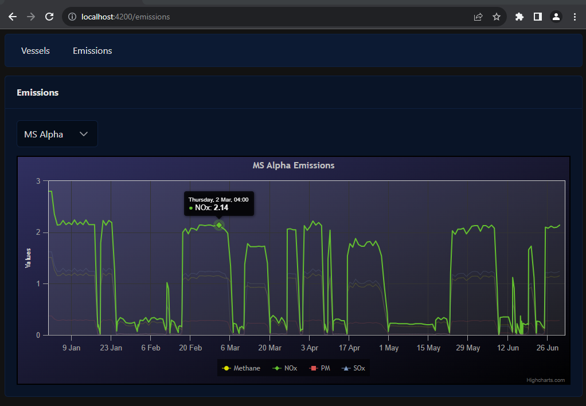

# NAVTOR Case 2

Please use git during the implementation to document the changes that have been made during the exercise. If you do not have a GitHub, Bitbucket or another account to publish the code please zip the local repo when the exercise is done and send it to us for review.

## Required libraries for this exercise

- Angular
- RxJS
- NgRx
- AgGrid
- Highcharts
- PrimeNg (Optional)
  - If you do not have any experience with PrimeNg, use your preferred component library.
- Nx (Optional)
  - If you have experience with nx please use it.

## Tasks

1. Generate an Angular application using Angular cli (or nx, optional).

2. Install the necessary packages for ngrx, ag-grid, highcharts and primeng (or your preferred component library)

3. Create some sort of navigation on the page. (side-menu or navigation bar)  
   It must contain two navigation options.
   - a. Vessels
   - b. Emissions

4. Create a page for the Vessels option.  
   The page should show a grid with Vessel information.  
   Use the following url to get the data:  
   `https://frontendteamfiles.blob.core.windows.net/exercises/vessels.json`

5. Create the models, services, ui components, state and facades necessary for the Vessel page.  
   Here is an example of how it could look like. You can use the style/theme you wish.  
   

6. Create a page for the Emissions option.  
   The page should show a basic line chart for Vessel Emissions information.  
   Use at least two of the emission types in the data set.  
   The page should have a dropdown to change the vessel.  
   Use the following url to get the data:  
   `https://frontendteamfiles.blob.core.windows.net/exercises/emissions.json`

7. Create the models, services, state and facades necessary for the Emissions page.  
   Here is an example of how it could look like. You can use the style/theme you wish.  
   
